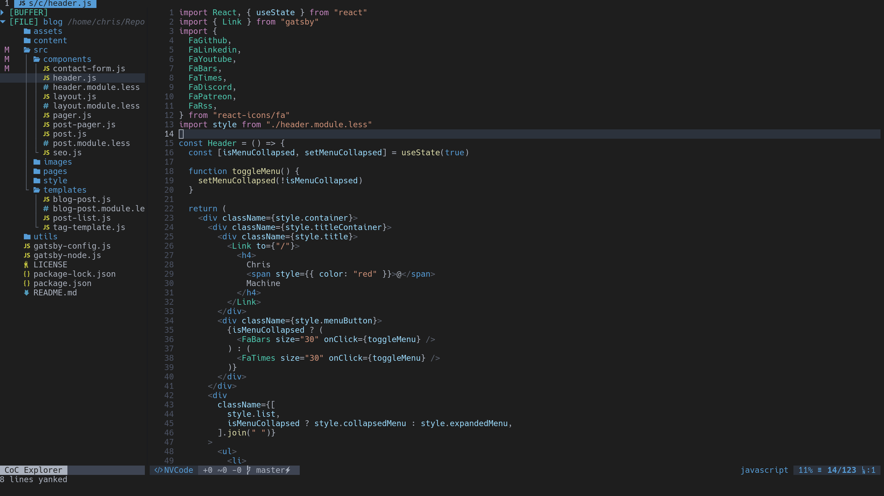

# NVCode Colorscheme



This colorscheme attempts mirror VSCodes dark+ theme

## Installing

With `Vim-plug`

```
Plug 'christianchiarulli/nvcode.vim'
```

## Configuring

Put this in your `init.vim`

```
hi Comment cterm=italic
let g:nvcode_hide_endofbuffer=1
let g:nvcode_terminal_italics=1
let g:nvcode_termcolors=256

syntax on
colorscheme nvcode


" checks if your terminal has 24-bit color support
if (has("termguicolors"))
    set termguicolors
    hi LineNr ctermbg=NONE guibg=NONE
endif
```


